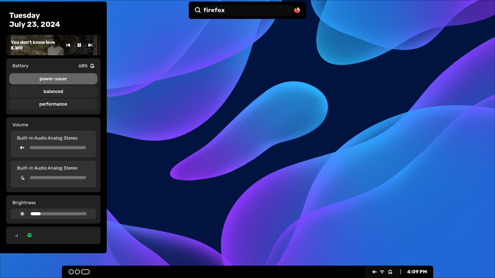

# danielsodium's dotfiles

These are my dotfiles for my current laptop setup. I use Hyprland with Aylur's GTK Widgets for my desktop, and Kitty with Neovide for my terminal emulator and code editor. AGS has a widget called "gsm" which connects with [gsm](https://github.com/danielsodium/gsm) for project session management. No guarantees that my setup will work for you, i use arch btw. 
